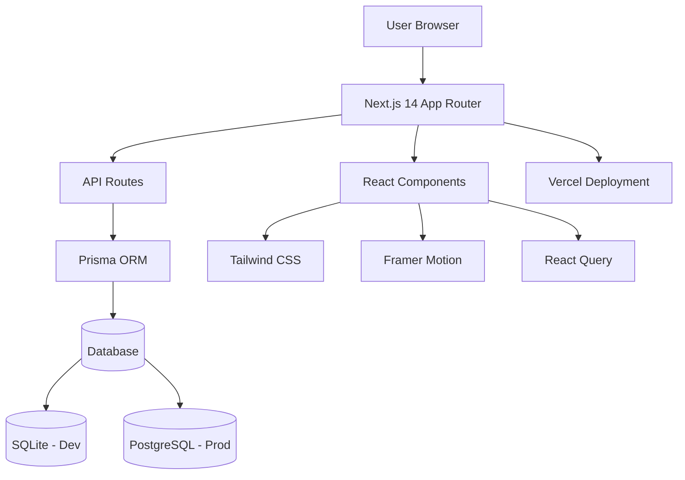

# Design Document

## Overview

The Freelancian MVP v0.1 is designed as a modern, single-page application built with Next.js 14, focusing on exceptional user experience for manual financial entry. The architecture follows a full-stack approach with Next.js handling both frontend and backend concerns, deployed on Vercel for simplicity and performance.

The system prioritizes beautiful UX/UI with Canva-like simplicity and Apple-inspired motion design, while maintaining a solid technical foundation that can easily scale to multi-user functionality in future versions.

## Architecture

### High-Level System Architecture



### Technology Stack

**Frontend:**
- Next.js 14 with App Router for modern React development
- TypeScript for type safety and better developer experience
- Tailwind CSS for utility-first styling and design system
- Framer Motion for smooth animations and micro-interactions
- React Hook Form for efficient form handling
- React Query for server state management and caching
- Recharts for data visualization and charts

**Backend:**
- Next.js API Routes for serverless backend functionality
- Prisma ORM for type-safe database operations
- Zod for runtime validation and schema definition
- SQLite for development, PostgreSQL for production

**Deployment:**
- Vercel for zero-configuration deployment
- Automatic CI/CD with GitHub integration
- Edge functions for optimal performance

## Components and Interfaces

### Core Component Architecture

```mermaid
flowchart TD
    App[App Layout] --> Dashboard[Dashboard Page]
    App --> EntryForm[Entry Form Page]
    App --> Reports[Reports Page]
    App --> EntryList[Entry List Page]
    App --> Import[Import Page]
    
    Dashboard --> MetricsCards[Metrics Cards]
    Dashboard --> RecentEntries[Recent Entries List]
    Dashboard --> MiniChart[Mini Chart Component]
    
    EntryForm --> FormFields[Form Fields]
    EntryForm --> LivePreview[Live Preview Card]
    EntryForm --> CalculationHelpers[VAT/WHT Helpers]
    
    Reports --> MonthlyChart[Monthly Chart]
    Reports --> SummaryStats[Summary Statistics]
    Reports --> PeriodSelector[Period Selector]
    
    EntryList --> SearchFilter[Search & Filter]
    EntryList --> EntryCards[Entry Cards]
    EntryList --> Pagination[Pagination]
    
    Import --> FileUpload[File Upload]
    Import --> MappingPreview[Mapping Preview]
    Import --> ImportResults[Import Results]
```



### Component Specifications

**Layout Components:**
- `MainLayout`: Primary application shell with navigation
- `PageLayout`: Individual page wrapper with consistent spacing
- `Card`: Reusable card component with hover effects

**Form Components:**
- `EntryForm`: Split-screen form with live preview
- `Input`: Styled input with validation states
- `Select`: Custom dropdown with smooth animations
- `DatePicker`: Calendar input for date selection
- `CurrencyInput`: Specialized input for Thai Baht amounts

**Data Display Components:**
- `MetricCard`: Animated metric display with trend indicators
- `EntryCard`: Individual entry display with quick actions
- `Chart`: Wrapper for Recharts with consistent styling
- `DataTable`: Sortable, filterable table for entry lists

**Interactive Components:**
- `Button`: Multi-variant button with loading states
- `Modal`: Accessible modal with backdrop and animations
- `Toast`: Notification system for user feedback
- `ConfirmDialog`: Confirmation dialogs for destructive actions

### API Interface Design

**Core API Endpoints (Following REST Best Practices):**

```typescript
// Entry Management (Resource-based URLs)
GET    /api/entries                 // List entries with filtering & pagination
POST   /api/entries                 // Create new entry
GET    /api/entries/[id]            // Get single entry
PUT    /api/entries/[id]            // Update entire entry
PATCH  /api/entries/[id]            // Partial update entry
DELETE /api/entries/[id]            // Delete entry

// Reports & Analytics (Nested resources)
GET    /api/reports/dashboard       // Dashboard summary metrics
GET    /api/reports/trends          // Monthly/quarterly trends
GET    /api/reports/summary         // Detailed financial summary

// Data Import (Action-based for non-CRUD operations)
POST   /api/import/preview          // Preview import data
POST   /api/import/execute          // Execute import
GET    /api/import/[id]/status      // Check import status
```

**API Design Principles Applied:**

1. **Resource-based URLs**: `/api/entries` instead of `/api/v1/entries` (versioning through headers)
2. **HTTP Methods**: Proper use of GET, POST, PUT, PATCH, DELETE
3. **Nested Resources**: `/api/reports/dashboard` for related functionality
4. **Consistent Naming**: Plural nouns for collections, singular for actions
5. **Stateless**: Each request contains all necessary information
6. **Idempotent Operations**: PUT and DELETE are idempotent
7. **Content Negotiation**: Accept/Content-Type headers for format specification
8. **HATEOAS**: Include navigation links in responses
9. **Standard Status Codes**: Proper HTTP status code usage
10. **Request/Response Envelope**: Consistent response structure

**API Versioning Strategy:**

```typescript
// Header-based versioning (preferred)
Accept: application/vnd.freelancian.v1+json
Content-Type: application/json

// URL versioning (fallback)
/api/v1/entries  // Only if header versioning not supported

// Version negotiation
interface ApiVersion {
  version: string;
  deprecated?: boolean;
  sunset?: string;  // ISO 8601 date when version will be removed
}
```

**HTTP Status Code Usage:**

```typescript
// Success responses
200 OK          // Successful GET, PUT, PATCH
201 Created     // Successful POST
204 No Content  // Successful DELETE

// Client error responses
400 Bad Request     // Invalid request format
401 Unauthorized    // Authentication required (future)
403 Forbidden       // Access denied (future)
404 Not Found       // Resource doesn't exist
409 Conflict        // Resource conflict (duplicate)
422 Unprocessable   // Validation errors

// Server error responses
500 Internal Error  // Unexpected server error
503 Service Unavailable // Temporary unavailability
```

**Request/Response Interfaces (Following API Standards):**

```typescript
// Request DTOs (Data Transfer Objects)
interface CreateEntryRequest {
  kind: 'income' | 'expense';
  title: string;
  docDate?: string;           // camelCase for consistency
  transferDate?: string;
  clientName?: string;
  vendorName?: string;
  productService?: string;
  accountName?: string;
  priceGrossThb?: number;
  vatThb?: number;
  withholdingThb?: number;
  commissionThb?: number;
  project?: string;
  remark?: string;
  invoiceNo?: string;
}

interface UpdateEntryRequest extends Partial<CreateEntryRequest> {
  id: string;
}

// Standard API Response Envelope
interface ApiResponse<T> {
  success: boolean;
  data: T;
  message?: string;
  timestamp: string;
  requestId: string;
}

// Paginated Response (RFC 5988 compliant)
interface PaginatedResponse<T> {
  success: boolean;
  data: T[];
  pagination: {
    page: number;
    limit: number;
    total: number;
    totalPages: number;
    hasNext: boolean;
    hasPrev: boolean;
  };
  links: {
    self: string;
    first: string;
    last: string;
    next?: string;
    prev?: string;
  };
  timestamp: string;
  requestId: string;
}

// Error Response (RFC 7807 Problem Details)
interface ApiErrorResponse {
  success: false;
  error: {
    type: string;           // URI identifying the problem type
    title: string;          // Human-readable summary
    status: number;         // HTTP status code
    detail: string;         // Human-readable explanation
    instance: string;       // URI identifying specific occurrence
    errors?: Record<string, string[]>; // Validation errors
  };
  timestamp: string;
  requestId: string;
}

// Query Parameters Interface
interface GetEntriesQuery {
  page?: number;
  limit?: number;
  kind?: 'income' | 'expense';
  month?: string;          // YYYY-MM format
  search?: string;
  sortBy?: 'date' | 'amount' | 'title';
  sortOrder?: 'asc' | 'desc';
  clientName?: string;
  vendorName?: string;
}
```

## Data Models

### Database Schema

```sql
-- Primary entries table (income + expense combined)
CREATE TABLE entries (
    id TEXT PRIMARY KEY,
    kind TEXT NOT NULL CHECK (kind IN ('income', 'expense')),
    title TEXT NOT NULL,
    doc_date DATE,
    transfer_date DATE,
    
    -- Client/Vendor information
    client_name TEXT,
    vendor_name TEXT,
    product_service TEXT,
    account_name TEXT,
    
    -- Financial amounts in Thai Baht
    price_gross_thb DECIMAL(14,2),
    vat_thb DECIMAL(14,2),
    withholding_thb DECIMAL(14,2),
    commission_thb DECIMAL(14,2),
    
    -- Computed total (generated column)
    total_net_thb DECIMAL(14,2) GENERATED ALWAYS AS (
        CASE
            WHEN kind = 'income' THEN
                COALESCE(price_gross_thb, 0) + COALESCE(vat_thb, 0) -
                COALESCE(withholding_thb, 0) - COALESCE(commission_thb, 0)
            WHEN kind = 'expense' THEN
                COALESCE(price_gross_thb, 0) + COALESCE(vat_thb, 0) -
                COALESCE(withholding_thb, 0)
        END
    ) STORED,
    
    -- Metadata
    project TEXT,
    remark TEXT,
    invoice_no TEXT,
    
    -- Timestamps
    created_at DATETIME DEFAULT CURRENT_TIMESTAMP,
    updated_at DATETIME DEFAULT CURRENT_TIMESTAMP
);

-- Performance indexes
CREATE INDEX idx_entries_kind_date ON entries(kind, doc_date DESC);
CREATE INDEX idx_entries_created ON entries(created_at DESC);
CREATE INDEX idx_entries_month ON entries(strftime('%Y-%m', doc_date));
```

### Prisma Schema

```prisma
model Entry {
  id                String   @id @default(cuid())
  kind              EntryKind
  title             String
  docDate           DateTime? @map("doc_date")
  transferDate      DateTime? @map("transfer_date")
  
  clientName        String?  @map("client_name")
  vendorName        String?  @map("vendor_name")
  productService    String?  @map("product_service")
  accountName       String?  @map("account_name")
  
  priceGrossThb     Decimal? @map("price_gross_thb") @db.Decimal(14, 2)
  vatThb            Decimal? @map("vat_thb") @db.Decimal(14, 2)
  withholdingThb    Decimal? @map("withholding_thb") @db.Decimal(14, 2)
  commissionThb     Decimal? @map("commission_thb") @db.Decimal(14, 2)
  totalNetThb       Decimal? @map("total_net_thb") @db.Decimal(14, 2)
  
  project           String?
  remark            String?
  invoiceNo         String?  @map("invoice_no")
  
  createdAt         DateTime @default(now()) @map("created_at")
  updatedAt         DateTime @updatedAt @map("updated_at")
  
  @@map("entries")
}

enum EntryKind {
  income
  expense
}
```

### TypeScript Types

```typescript
export interface Entry {
  id: string;
  kind: 'income' | 'expense';
  title: string;
  docDate?: Date;
  transferDate?: Date;
  clientName?: string;
  vendorName?: string;
  productService?: string;
  accountName?: string;
  priceGrossThb?: number;
  vatThb?: number;
  withholdingThb?: number;
  commissionThb?: number;
  totalNetThb?: number;
  project?: string;
  remark?: string;
  invoiceNo?: string;
  createdAt: Date;
  updatedAt: Date;
}

export interface DashboardMetrics {
  totalIncome: number;
  totalExpenses: number;
  netAmount: number;
  entryCount: {
    income: number;
    expense: number;
    total: number;
  };
}

export interface MonthlyTrend {
  month: string;
  totalIncome: number;
  totalExpenses: number;
  netAmount: number;
  entryCount: number;
}
```

## Error Handling

### Error Response Format

```typescript
interface ApiError {
  error: {
    code: string;
    message: string;
    details?: Record<string, string[]>;
  };
  requestId: string;
}
```

### Error Categories

**Validation Errors (400):**
- Invalid input data format
- Business rule violations (e.g., withholding > 3%)
- Required field missing

**Not Found Errors (404):**
- Entry not found
- Invalid endpoint

**Server Errors (500):**
- Database connection issues
- Unexpected application errors

### Frontend Error Handling

```typescript
// Error boundary for React components
export function ErrorBoundary({ children }: { children: React.ReactNode }) {
  return (
    <ErrorBoundaryComponent
      fallback={<ErrorFallback />}
      onError={(error, errorInfo) => {
        console.error('Application error:', error, errorInfo);
        // Future: Send to monitoring service
      }}
    >
      {children}
    </ErrorBoundaryComponent>
  );
}

// API error handling with React Query
export function useCreateEntry() {
  return useMutation({
    mutationFn: createEntry,
    onError: (error: ApiError) => {
      toast.error(error.error.message);
      // Handle specific error codes
      if (error.error.code === 'VALIDATION_ERROR') {
        // Show field-specific errors
      }
    },
    onSuccess: () => {
      toast.success('Entry created successfully');
      queryClient.invalidateQueries(['entries']);
    },
  });
}
```

## Testing Strategy

### Testing Pyramid

**Unit Tests (70%):**
- Utility functions (calculations, validations)
- Individual React components
- API route handlers
- Database operations

**Integration Tests (20%):**
- API endpoint flows
- Component interactions
- Form submissions with validation
- Database queries with Prisma

**End-to-End Tests (10%):**
- Critical user journeys
- Manual entry workflow
- Dashboard loading and interactions
- CSV import process

### Testing Tools

```typescript
// Jest + Testing Library for unit tests
import { render, screen, fireEvent } from '@testing-library/react';
import { EntryForm } from './EntryForm';

test('should update live preview when form data changes', () => {
  render(<EntryForm />);
  
  const titleInput = screen.getByLabelText('Title');
  fireEvent.change(titleInput, { target: { value: 'Test Entry' } });
  
  expect(screen.getByText('Test Entry')).toBeInTheDocument();
});

// Playwright for E2E tests
import { test, expect } from '@playwright/test';

test('should create entry through manual form', async ({ page }) => {
  await page.goto('/entries/new');
  
  await page.fill('[data-testid="title-input"]', 'Voice Over Project');
  await page.selectOption('[data-testid="kind-select"]', 'income');
  await page.fill('[data-testid="amount-input"]', '7000');
  
  await page.click('[data-testid="save-button"]');
  
  await expect(page.locator('[data-testid="success-message"]')).toBeVisible();
});
```

### Performance Testing

**Core Web Vitals Targets:**
- Largest Contentful Paint (LCP): < 2.5s
- First Input Delay (FID): < 100ms
- Cumulative Layout Shift (CLS): < 0.1

**Animation Performance:**
- All animations maintain 60fps
- Use transform and opacity for GPU acceleration
- Implement proper loading states to prevent layout shift

### Accessibility Testing

**Automated Testing:**
- axe-core integration for accessibility violations
- Color contrast validation
- Keyboard navigation testing

**Manual Testing:**
- Screen reader compatibility (NVDA, JAWS, VoiceOver)
- Keyboard-only navigation
- High contrast mode support
- Reduced motion preference respect

## Security Considerations

### Input Validation

```typescript
// Zod schemas for runtime validation
export const CreateEntrySchema = z.object({
  kind: z.enum(['income', 'expense']),
  title: z.string().min(1).max(255),
  priceGrossThb: z.number().nonnegative().optional(),
  vatThb: z.number().nonnegative().optional(),
  withholdingThb: z.number().nonnegative().optional(),
}).refine((data) => {
  // Business rule: withholding cannot exceed 3% of gross
  if (data.priceGrossThb && data.withholdingThb) {
    return data.withholdingThb <= data.priceGrossThb * 0.03;
  }
  return true;
}, {
  message: 'Withholding cannot exceed 3% of gross amount',
  path: ['withholdingThb'],
});
```

### Data Protection

- Input sanitization for all user data
- SQL injection prevention through Prisma ORM
- XSS prevention through React's built-in escaping
- CSRF protection through SameSite cookies

### Future Security Considerations

- Authentication middleware ready for user system
- Rate limiting for API endpoints
- Data encryption for sensitive information
- Audit logging for financial transactions

## Performance Optimizations

### Frontend Optimizations

```typescript
// Code splitting with dynamic imports
const ReportsPage = dynamic(() => import('./ReportsPage'), {
  loading: () => <PageSkeleton />,
});

// Image optimization
import Image from 'next/image';

// React Query for intelligent caching
export function useEntries(filters: EntryFilters) {
  return useQuery({
    queryKey: ['entries', filters],
    queryFn: () => fetchEntries(filters),
    staleTime: 5 * 60 * 1000, // 5 minutes
    cacheTime: 10 * 60 * 1000, // 10 minutes
  });
}

// Optimistic updates for better UX
export function useCreateEntry() {
  return useMutation({
    mutationFn: createEntry,
    onMutate: async (newEntry) => {
      // Cancel outgoing refetches
      await queryClient.cancelQueries(['entries']);
      
      // Snapshot previous value
      const previousEntries = queryClient.getQueryData(['entries']);
      
      // Optimistically update
      queryClient.setQueryData(['entries'], (old: any) => ({
        ...old,
        data: [newEntry, ...old.data],
      }));
      
      return { previousEntries };
    },
    onError: (err, newEntry, context) => {
      // Rollback on error
      queryClient.setQueryData(['entries'], context?.previousEntries);
    },
  });
}
```

### Backend Optimizations

```typescript
// Database query optimization
export async function getEntriesWithPagination({
  kind,
  month,
  limit = 50,
  offset = 0,
}: GetEntriesQuery) {
  const where: Prisma.EntryWhereInput = {};
  
  if (kind) where.kind = kind;
  if (month) {
    const startDate = new Date(`${month}-01`);
    const endDate = new Date(startDate.getFullYear(), startDate.getMonth() + 1, 0);
    where.docDate = { gte: startDate, lte: endDate };
  }
  
  const [entries, total] = await Promise.all([
    prisma.entry.findMany({
      where,
      orderBy: { docDate: 'desc' },
      take: limit,
      skip: offset,
    }),
    prisma.entry.count({ where }),
  ]);
  
  return { entries, total, hasMore: offset + limit < total };
}

// Response caching for static data
export async function GET(request: Request) {
  const response = await getReportsSummary();
  
  return new Response(JSON.stringify(response), {
    headers: {
      'Content-Type': 'application/json',
      'Cache-Control': 'public, s-maxage=300', // 5 minutes
    },
  });
}
```

This design provides a comprehensive foundation for building the Freelancian MVP with excellent performance, maintainability, and user experience while remaining extensible for future features.