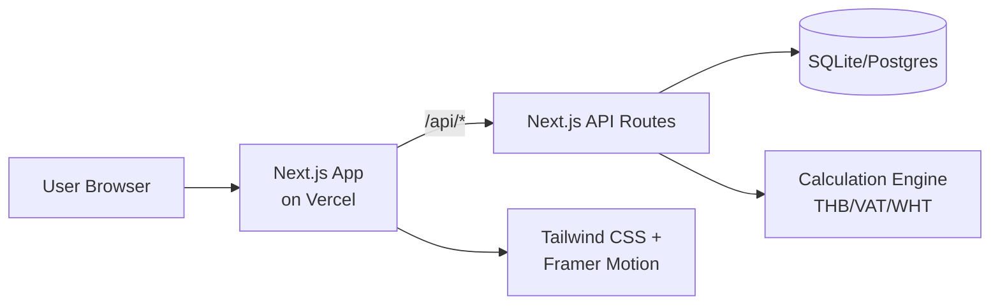
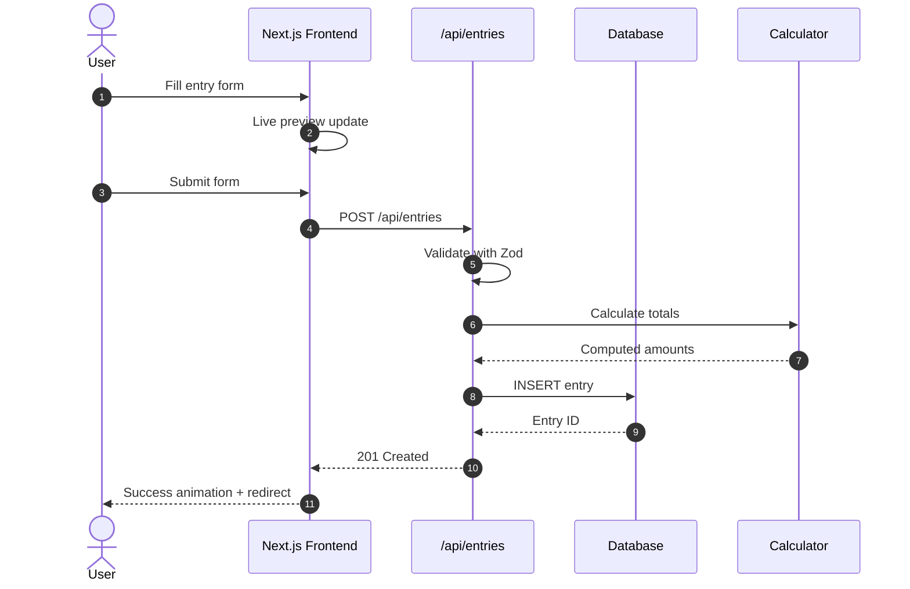
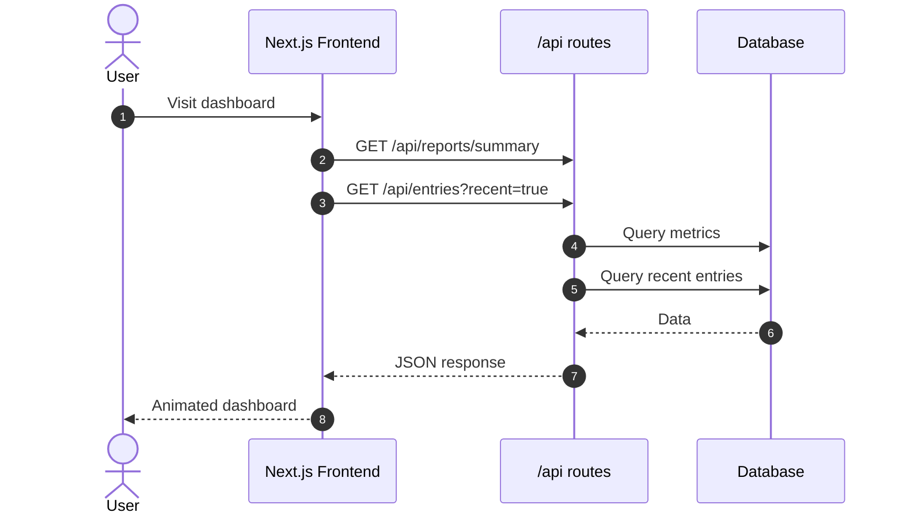

# Architecture MVP v0.1 - System Design

## Overview

This is a **simplified architecture** for the Freelancian MVP focused on manual entry with excellent UX/UI. We've removed authentication, payment integration, and AI features to focus on core functionality while maintaining a foundation for future growth.

---

## 1) High-Level Architecture



**Key Principles**:

-   **Single user mode** for MVP (no authentication)
-   **Excellent UX/UI** with Canva-simple, Apple-like feel
-   **Solid foundation** for future multi-user and premium features
-   **Simple deployment** on Vercel with minimal dependencies

---

## 2) System Components

### Frontend (React/TypeScript)

-   **Next.js 14** with App Router
-   **Tailwind CSS** for styling
-   **Framer Motion** for animations
-   **Recharts** for simple charts
-   **React Hook Form** for form handling
-   **Zod** for client-side validation

### Backend (Next.js API)

-   **Next.js Route Handlers** for CRUD operations
-   **Prisma ORM** for database operations
-   **Zod** for API validation
-   **SQLite** for development, **Postgres** for production

### Database

-   **Single table design** for entries (income + expense)
-   **Computed columns** for totals
-   **Indexes** for common queries
-   **Simple schema** without user relations

---

## 3) Data Flow (Simplified)

### Manual Entry Flow



### Dashboard Loading



---

## 4) Database Schema (MVP)

```sql
-- Single table for all entries (income + expense)
CREATE TABLE entries (
    id TEXT PRIMARY KEY,
    kind TEXT NOT NULL CHECK (kind IN ('income', 'expense')),
    title TEXT NOT NULL,
    doc_date DATE,
    transfer_date DATE,

    -- Client/Vendor (simplified)
    client_name TEXT,
    vendor_name TEXT,
    product_service TEXT,
    account_name TEXT,

    -- Financial amounts (THB)
    price_gross_thb DECIMAL(14,2),
    vat_thb DECIMAL(14,2),
    withholding_thb DECIMAL(14,2),
    commission_thb DECIMAL(14,2),
    total_net_thb DECIMAL(14,2) GENERATED ALWAYS AS (
        CASE
            WHEN kind = 'income' THEN
                COALESCE(price_gross_thb, 0) + COALESCE(vat_thb, 0) -
                COALESCE(withholding_thb, 0) - COALESCE(commission_thb, 0)
            WHEN kind = 'expense' THEN
                COALESCE(price_gross_thb, 0) + COALESCE(vat_thb, 0) -
                COALESCE(withholding_thb, 0)
        END
    ) STORED,

    -- Metadata
    project TEXT,
    remark TEXT,
    invoice_no TEXT,

    -- Timestamps
    created_at DATETIME DEFAULT CURRENT_TIMESTAMP,
    updated_at DATETIME DEFAULT CURRENT_TIMESTAMP
);

-- Indexes for performance
CREATE INDEX idx_entries_kind_date ON entries(kind, doc_date DESC);
CREATE INDEX idx_entries_created ON entries(created_at DESC);
CREATE INDEX idx_entries_month ON entries(strftime('%Y-%m', doc_date));
```

---

## 5) API Design (RESTful)

### Core Endpoints

```typescript
// GET /api/entries
interface GetEntriesQuery {
    kind?: 'income' | 'expense';
    month?: string; // YYYY-MM
    limit?: number;
    offset?: number;
}

interface GetEntriesResponse {
    items: Entry[];
    total: number;
    hasMore: boolean;
}

// POST /api/entries
interface CreateEntryRequest {
    kind: 'income' | 'expense';
    title: string;
    doc_date?: string;
    transfer_date?: string;
    client_name?: string;
    vendor_name?: string;
    product_service?: string;
    account_name?: string;
    price_gross_thb?: number;
    vat_thb?: number;
    withholding_thb?: number;
    commission_thb?: number;
    project?: string;
    remark?: string;
    invoice_no?: string;
}

// GET /api/reports/summary
interface SummaryResponse {
    totalIncome: number;
    totalExpenses: number;
    netAmount: number;
    entryCount: number;
    monthlyData: MonthlyData[];
}
```

### Validation Schema (Zod)

```typescript
import { z } from 'zod';

export const CreateEntrySchema = z
    .object({
        kind: z.enum(['income', 'expense']),
        title: z.string().min(1).max(255),
        doc_date: z.string().date().optional(),
        transfer_date: z.string().date().optional(),
        client_name: z.string().max(255).optional(),
        vendor_name: z.string().max(255).optional(),
        product_service: z.string().max(255).optional(),
        account_name: z.string().max(255).optional(),
        price_gross_thb: z.number().nonnegative().optional(),
        vat_thb: z.number().nonnegative().optional(),
        withholding_thb: z.number().nonnegative().optional(),
        commission_thb: z.number().nonnegative().optional(),
        project: z.string().max(255).optional(),
        remark: z.string().max(500).optional(),
        invoice_no: z.string().max(255).optional(),
    })
    .refine(
        (data) => {
            // Business rule: withholding cannot exceed 3% of gross
            if (data.price_gross_thb && data.withholding_thb) {
                return data.withholding_thb <= data.price_gross_thb * 0.03;
            }
            return true;
        },
        {
            message: 'Withholding cannot exceed 3% of gross amount',
            path: ['withholding_thb'],
        }
    );
```

---

## 6) Frontend Architecture

### Component Structure

```typescript
// Atomic Design Pattern
/components
  /ui                 // Atoms
    Button.tsx
    Input.tsx
    Card.tsx
    Chart.tsx
    Select.tsx

  /features           // Molecules/Organisms
    /entries
      EntryForm.tsx
      EntryCard.tsx
      EntryList.tsx
      EntryPreview.tsx
    /dashboard
      MetricsCard.tsx
      RecentEntries.tsx
      MiniChart.tsx
    /reports
      MonthlyChart.tsx
      SummaryStats.tsx

  /layouts           // Templates
    MainLayout.tsx
    PageLayout.tsx
```

### State Management (Simple)

```typescript
// Using React Query for server state
import { useQuery, useMutation } from '@tanstack/react-query';

// Hooks for data fetching
export const useEntries = (filters: GetEntriesQuery) => {
    return useQuery({
        queryKey: ['entries', filters],
        queryFn: () => fetchEntries(filters),
    });
};

export const useCreateEntry = () => {
    return useMutation({
        mutationFn: createEntry,
        onSuccess: () => {
            queryClient.invalidateQueries(['entries']);
            queryClient.invalidateQueries(['reports']);
        },
    });
};
```

---

## 7) UX/UI Implementation

### Animation Strategy

```typescript
// Framer Motion variants
export const fadeInUp = {
    initial: { opacity: 0, y: 20 },
    animate: { opacity: 1, y: 0 },
    exit: { opacity: 0, y: -20 },
    transition: { duration: 0.3, ease: 'easeOut' },
};

export const scaleOnHover = {
    whileHover: { scale: 1.02 },
    whileTap: { scale: 0.98 },
    transition: { duration: 0.2 },
};

export const numberCounter = {
    initial: { opacity: 0 },
    animate: { opacity: 1 },
    transition: { duration: 0.5, ease: 'easeOut' },
};
```

### Design System

```typescript
// Tailwind config for consistent design
export const theme = {
    colors: {
        primary: {
            50: '#f0f9ff',
            500: '#3b82f6',
            600: '#2563eb',
        },
        gray: {
            50: '#f9fafb',
            100: '#f3f4f6',
            500: '#6b7280',
            900: '#111827',
        },
    },
    borderRadius: {
        lg: '12px',
        xl: '16px',
    },
    boxShadow: {
        soft: '0 4px 6px -1px rgba(0, 0, 0, 0.1)',
        card: '0 10px 15px -3px rgba(0, 0, 0, 0.1)',
    },
};
```

---

## 8) Performance Optimizations

### Frontend

-   **Code splitting** with Next.js dynamic imports
-   **Image optimization** with Next.js Image component
-   **React Query** for smart caching and background updates
-   **Virtualization** for large entry lists
-   **Optimistic updates** for better perceived performance

### Backend

-   **Database indexes** for common query patterns
-   **Pagination** for large datasets
-   **Response caching** for static data
-   **Computed columns** for complex calculations

### Bundle Optimization

```javascript
// next.config.js
module.exports = {
    experimental: {
        optimizeCss: true,
    },
    compiler: {
        removeConsole: process.env.NODE_ENV === 'production',
    },
    images: {
        formats: ['image/webp', 'image/avif'],
    },
};
```

---

## 9) Error Handling & Validation

### API Error Response Format

```typescript
interface ApiError {
  error: string;
  message: string;
  details?: Record<string, string[]>; // Validation errors
  code: string;
}

// Example responses
// 400 Bad Request
{
  "error": "VALIDATION_ERROR",
  "message": "Invalid input data",
  "details": {
    "title": ["Title is required"],
    "price_gross_thb": ["Must be a positive number"]
  },
  "code": "VAL_001"
}

// 500 Internal Server Error
{
  "error": "INTERNAL_ERROR",
  "message": "Something went wrong",
  "code": "INT_001"
}
```

### Frontend Error Boundaries

```typescript
// Error boundary for graceful error handling
export const ErrorBoundary: React.FC<{ children: React.ReactNode }> = ({
    children,
}) => {
    return (
        <ErrorBoundaryComponent
            fallback={<ErrorFallback />}
            onError={(error, errorInfo) => {
                console.error('Error caught by boundary:', error, errorInfo);
                // Log to monitoring service in production
            }}>
            {children}
        </ErrorBoundaryComponent>
    );
};
```

---

## 10) Deployment Strategy

### Vercel Configuration

```json
// vercel.json
{
    "functions": {
        "app/api/**": {
            "maxDuration": 10
        }
    },
    "env": {
        "DATABASE_URL": "@database-url",
        "NODE_ENV": "production"
    },
    "build": {
        "env": {
            "NEXT_TELEMETRY_DISABLED": "1"
        }
    }
}
```

### Environment Setup

```bash
# Development
DATABASE_URL="file:./dev.db"
NODE_ENV="development"

# Production
DATABASE_URL="postgresql://..."
NODE_ENV="production"
```

---

## 11) Future Architecture Considerations

### Preparing for Scale (v0.2+)

**User Authentication Ready**:

```sql
-- Future user table
CREATE TABLE users (
    id TEXT PRIMARY KEY,
    email TEXT UNIQUE NOT NULL,
    created_at DATETIME DEFAULT CURRENT_TIMESTAMP
);

-- Add user_id to entries
ALTER TABLE entries ADD COLUMN user_id TEXT REFERENCES users(id);
CREATE INDEX idx_entries_user_id ON entries(user_id);
```

**Payment Integration Ready**:

```sql
-- Future subscription table
CREATE TABLE subscriptions (
    id TEXT PRIMARY KEY,
    user_id TEXT REFERENCES users(id),
    plan TEXT NOT NULL,
    status TEXT NOT NULL,
    expires_at DATETIME,
    created_at DATETIME DEFAULT CURRENT_TIMESTAMP
);
```

**AI Service Integration Points**:

-   `/api/upload` endpoint structure ready
-   Document parsing service interface defined
-   File handling middleware prepared

### Migration Strategy

1. **v0.1 → v0.2**: Add user authentication

    - Add user table and relations
    - Migrate existing data to default user
    - Add authentication middleware

2. **v0.2 → v1.0**: Add premium features
    - Add payment tables and logic
    - Integrate AI parsing service
    - Add file upload capabilities

---

## 12) Monitoring & Observability

### Development Monitoring

```typescript
// Simple logging utility
export const logger = {
    info: (message: string, meta?: object) => {
        console.log(`[INFO] ${message}`, meta);
    },
    error: (message: string, error?: Error, meta?: object) => {
        console.error(`[ERROR] ${message}`, error, meta);
    },
    warn: (message: string, meta?: object) => {
        console.warn(`[WARN] ${message}`, meta);
    },
};
```

### Production Ready

```typescript
// Future: Integration with monitoring services
// - Vercel Analytics for performance
// - Sentry for error tracking
// - LogRocket for user session replay
// - Custom metrics for business KPIs
```

This architecture provides a solid foundation for the MVP while being easily extensible for future features. The focus is on delivering excellent UX/UI with clean, maintainable code that can evolve as the product grows.
